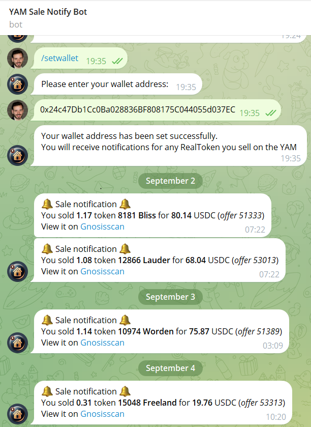
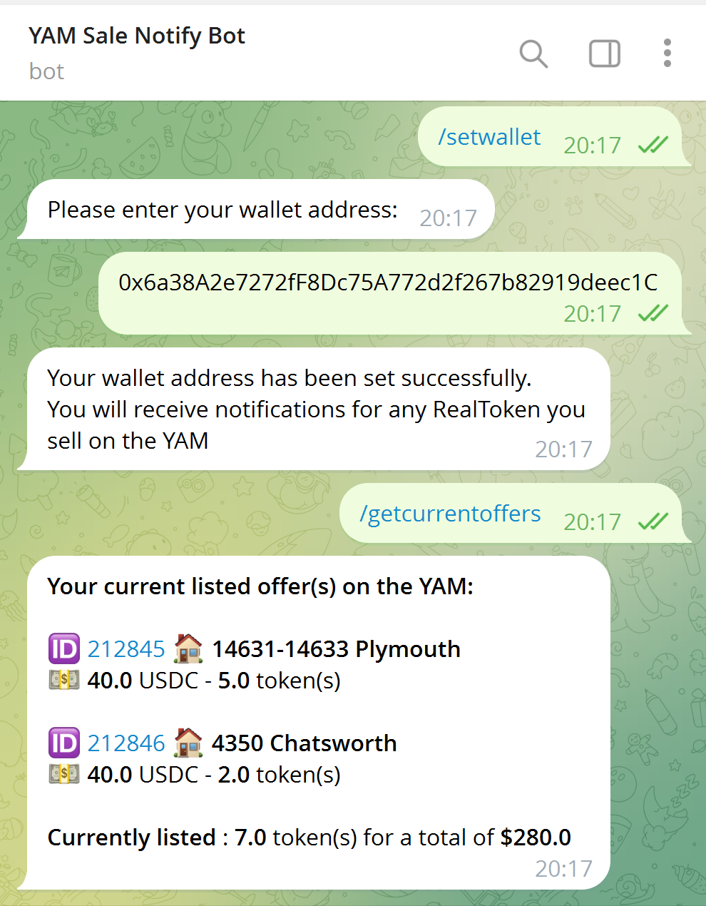

# YAM Sale Notify bot


**Stay updated with notifications for any RealToken you sell on the YAM.**  
This Telegram bot delivers real-time notifications for YAM v1 activity on the Gnosis blockchain. By providing your wallet address, you’ll receive notifications whenever someone purchases the RealTokens you’ve listed for sale. It also notifies you when one of your purchase offers is fulfilled.

You can also use the bot to list and track your **current active sales** directly from Telegram.

<p align="center">
  
  
</p>

---

## Table of Contents

- [YAM Sale Notify bot](#yam-sale-notify-bot)
- [Operational requirements](#operational-requirements)
- [System Requirements](#system-requirements)
- [Configuration](#configuration)
- [Installation & Execution](#installation--execution)
  - [Option A — Docker (Recommended)](#option-a--docker-recommended)
  - [Option B — Manual Installation (Without Docker)](#option-b--manual-installation-without-docker)
- [Bot core features](#bot-core-features)

---

## Operational requirements

The bot does **not scan or index the blockchain itself**. Instead, it relies on pre-processed YAM activity data produced by the [yam-indexing](https://github.com/RealToken-Community/yam-indexing) project.

The [yam-indexing](https://github.com/RealToken-Community/yam-indexing) service is responsible for indexing blockchain events and storing selected ones in the PostgreSQL table `event_queue`.

The **yam-sale-notify-bot** reads new entries from this table and sends Telegram notifications accordingly.

Each row in the table contains a `payload` column (`JSONB`) with the serialized event data, for example:

``` json
{
    "offerToken": "0x86b4f8135A39DC349A963969F33C3D030726cf61",
    "price": 60992674,
    "seller": "0xc9E5A65074549Cb765d78caE095e8eB5920e9c04",
    "transactionHash": "0x00e31459ee470b2af611d26874d2080f47cbf15e98520f951c3cdd6876e5a838",
    "offerId": 56348,
    "amount": 200000000000000000,
    "logIndex": 6,
    "blockNumber": 36161580,
    "buyer": "0x7Eb630839410a251b3E0aF7C7F3708C934fc02eB",
    "topic": "OfferAccepted",
    "buyerToken": "0xDDAfbb505ad214D7b80b1f830fcCc89B60fb7A83"
}
```

The [yam-indexing](https://github.com/RealToken-Community/yam-indexing) service must therefore be running alongside the bot
and configured to export events to the `event_queue` table.

---

## System Requirements

- Python 3.11+
- Docker & Docker Compose (optional but recommended)

---

## Configuration

### Configure Environment Variables

An example configuration file is provided: `.env.example`.  
Copy it to `.env` and update the values with your own secrets.

```env
YAM_SALE_NOTIFY_BOT_TOKEN=
YAM_SALE_NOTIFY_RPC_URLS=https://gnosis.drpc.org,https://rpc.ankr.com/gnosis/...,https://rpc.gnosischain.com
YAM_INDEXING_DB_PATH=../../yam-indexing/yam_indexing_db/yam_events.db

# Telegram alerts
TELEGRAM_ALERT_BOT_TOKEN=
TELEGRAM_ALERT_GROUP_ID=
```

> **Note:**  
> RPC URLs must be provided as a comma-separated string on a single line, without spaces.  
> For alerts, you can configure a Telegram bot and a Telegram group: the bot (using `TELEGRAM_ALERT_BOT_TOKEN`) must be added to the telegram chat group (`TELEGRAM_ALERT_GROUP_ID`) to receive automatic notifications about critical events such as failures or application stops.

---

### Configure the bot name and description

To configure the bot’s identity with the BotFather, update the following fields:

**Name**  
>YAM Sale Notify bot

**About**  
>Stay updated with notifications for any RealToken you sell on the YAM

**Description**  
>This bot monitors the YAM transactions on the Gnosis blockchain. By providing your wallet address, you will receive notifications for any RealToken you sell on the YAM.

**Picture**

Use the image located at `docs/assets/logo.png`

---

### Other configuration

Some default settings of the bot can be customized in the file:

```
.\bot\config\settings.py
```

**Available parameters:**

- `FRENQUENCY_UPDATING_REALTOKEN_DATA`  
  Interval in days between two realtoken data updates: `2`   

- `REALTOKENS_LIST_URL`  
  Endpoint for fetching the list of Realtokens. 


---

## Installation & Execution

### Option A — Docker (Recommended)

The project includes a **ready-to-use Docker integration**.

From the **project root directory** (where `docker-compose.yml` is located), build
(or rebuild) and start the service with:

```bash
docker compose up --build -d
```

This single command:
- Rebuilds the image if the source code changed
- Recreates the existing container without duplication
- Starts the service from a clean state


To stop the service:

```bash
docker compose stop
```

> For detailed information about what is happening inside the Docker container, see the section below.

---

### Option B — Manual Installation (Without Docker)

#### 1. Create and Activate a Python Virtual Environment

```bash
# Optional but recommended: create and activate a virtual environment
python3 -m venv .venv
source .venv/bin/activate
```

#### 2. Install python dependencies

```bash
pip install -r requirements.txt
```

#### 3. Running the Project

```bash
# Start the bot
python3 -m bot.main
```
---

## Bot core features

- **User wallet management**  
  - Each user can register **one wallet address**.  
  - The `getcurrentoffers` command lets users list **all their currently active sales** directly from Telegram.

- **Automatic monitoring** of the RealToken community API *(no API key required)*:  
  - Realtokens list: [https://api.realtoken.community/v1/token](https://api.realtoken.community/v1/token)  

- **Web3 handler (RPC management)**  
  - Manages all requests to the blockchain.  
  - Includes a **retry system** if a Web3 provider does not respond.  
  - Supports **automatic failover**: if one RPC URL is down, the handler switches to the next available RPC URL in the list.  
- **Internationalization**  
  - Multi-language support with per-user language preferences.